# Embedded Systems - Homework 1 Report

## Introduction
This report covers the modeling and control of a mass-spring-damper system using Simulink, with step-by-step illustrations of the process. The goal was to understand system response under various input forces and the effect of Proportional-Derivative (PD) control. 

## Problem 1: Development Models
### Part A: Comparison of Development Models
We compared the **Waterfall**, **Spiral**, and **Agile** models for their suitability in embedded system design. Here’s a brief overview:

- **Waterfall Model**: Linear and structured, ideal for projects with fixed requirements.
- **Spiral Model**: Focuses on iterative development and risk management, suited for complex projects.
- **Agile Model**: Emphasizes flexibility, customer feedback, and collaboration, ideal for dynamic requirements.

### Part B: Concurrent Engineering
Concurrent engineering allows simultaneous design and testing of various system components, reducing development time. An example is **AT&T’s PBX systems**, where concurrent engineering enabled better collaboration and faster time-to-market.

## Problem 2: Mass-Spring-Damper System Modeling

### Part A: System Setup
We modeled a mass-spring-damper system with the following parameters:

- **Mass (m)**: 1 kg
- **Damping Coefficient (b)**: 10 Ns/m
- **Spring Constant (k)**: 100 N/m

The system follows this equation of motion:

$$
F(t) = k \cdot x(t) + b \cdot \frac{dx(t)}{dt} + m \cdot \frac{d^2x(t)}{dt^2}
$$

and this is the Proportional-Derivative (PD) control law:

$$
F(t) = -K_p \cdot x(t) - K_d \cdot \frac{dx(t)}{dt}
$$

We used integrator blocks in Simulink to set up the model and simulate the system behavior.
here's the model without controller : 

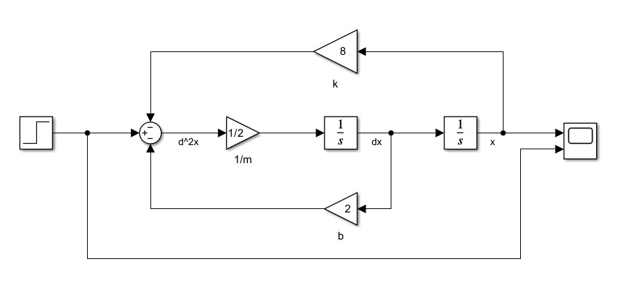

and this is the model with addition of controller:

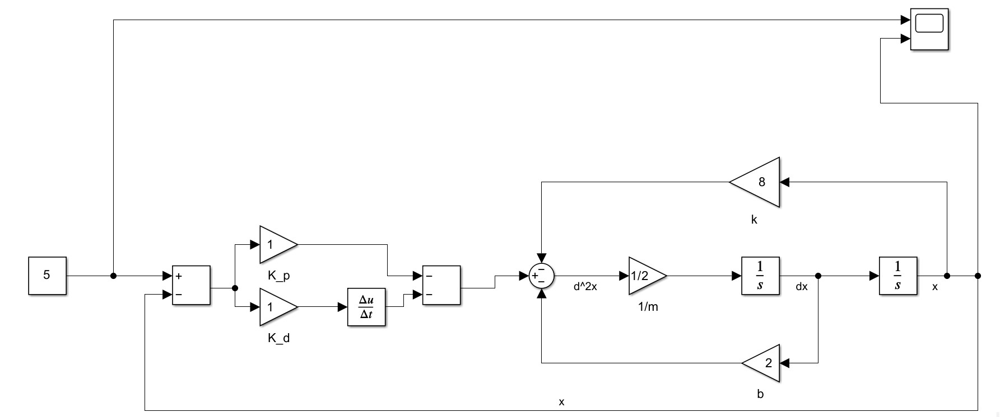

### Part B: Simulation Process and Response
We tested the system under different conditions and captured each step in the process. Below are the screenshots and descriptions of each stage.

1. **Initial Model Setup** 
   - A basic mass-spring-damper system was set up in Simulink using integrator and summation blocks to represent the differential equations.

2. **Parameter Initialization** 
   - Set values for mass \( m \), damping coefficient \( b \), and spring constant \( k \) in the model parameters.

3. **Step Force Input at \( t=0 \)** 
   - Applied a step force input of 10 N at \( t = 0 \). The system response was observed.

4. **System Response without Control (Step Input)** 
   - The response showed oscillations without any control mechanism in place, highlighting the natural damping effect.

5. **Sine Wave Input Setup** 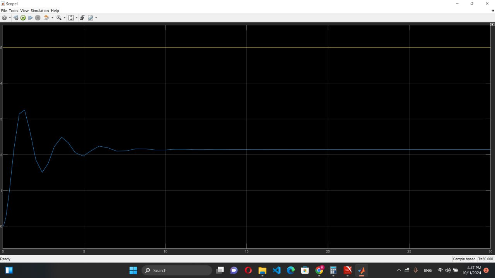
   - Replaced the step input with a sine wave input of amplitude 10 and frequency \( 2\pi \) rad/s.

6. **System Response to Sine Wave Input** 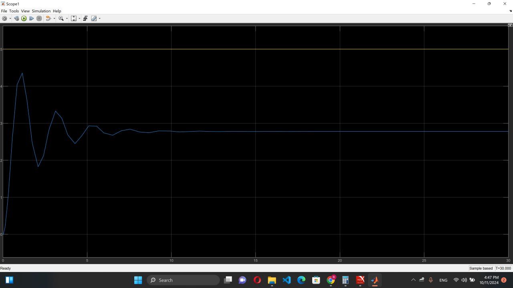
   - Observed the oscillatory response due to the continuous sinusoidal input force.

7. **PD Controller Addition** 
   - Added a Proportional-Derivative (PD) controller block to control the position \( x(t) \) of the mass.

8. **Setting Initial PD Gains** \( K_p = 1 \), \( K_d = 0 \) 
   - Set the proportional gain \( K_p = 1 \) and derivative gain \( K_d = 0 \) to observe the effect of proportional control only.

9. **Response with Initial PD Gains** 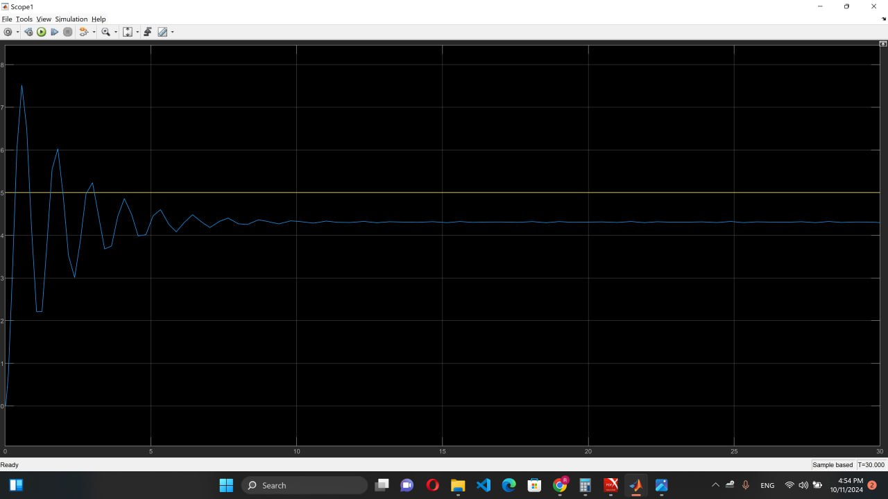
   - The system response was slightly improved, but the oscillations remained.

10. **Increasing Proportional Gain to 1000** \( K_p = 1000 \), \( K_d = 0 \) 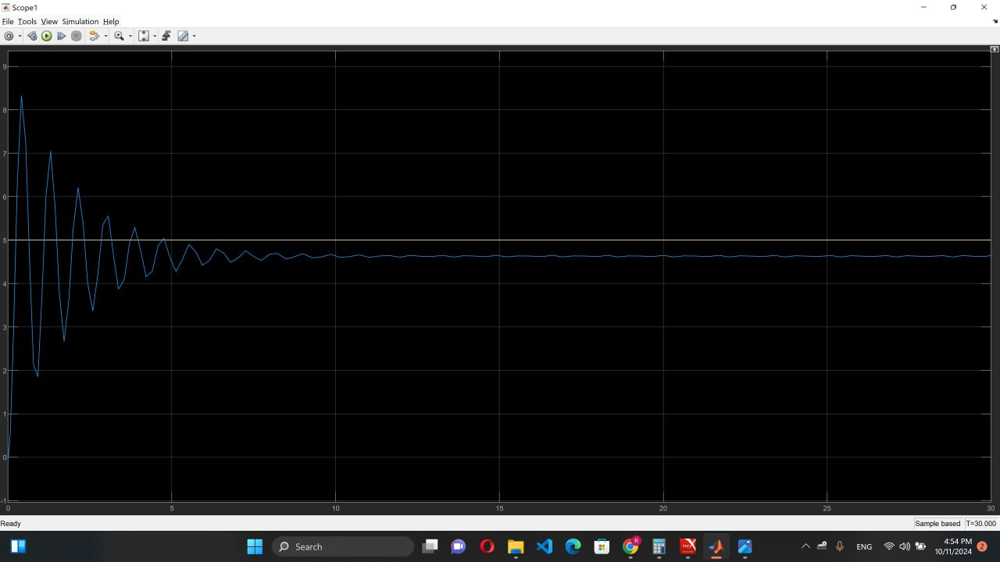
    - Increased \( K_p \) to 1000 to improve the response rate further.

11. **Effect of Higher \( K_p \) without \( K_d \)** 
    - Higher \( K_p \) led to a faster response but introduced instability due to lack of damping control.

12. **Adding Derivative Control** \( K_p = 1000 \), \( K_d = 1 \) 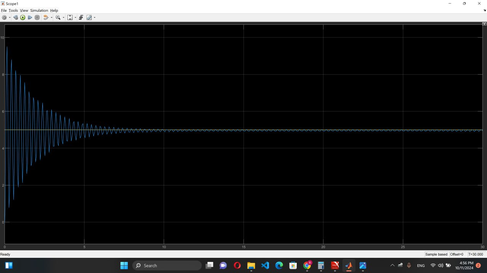
    - Introduced a derivative gain \( K_d = 1 \) to help reduce oscillations and improve stability.

13. **Response with PD Control** \( K_p = 1000 \), \( K_d = 1 \) 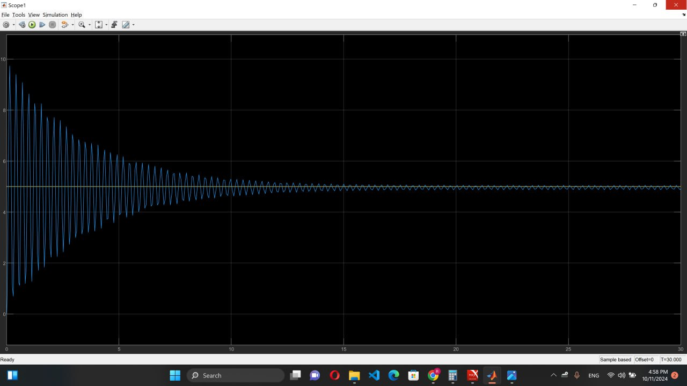
    - Observed a more stable response with reduced overshoot due to the derivative component.

14. **Increasing \( K_d \) to 5** \( K_p = 1000 \), \( K_d = 5 \) 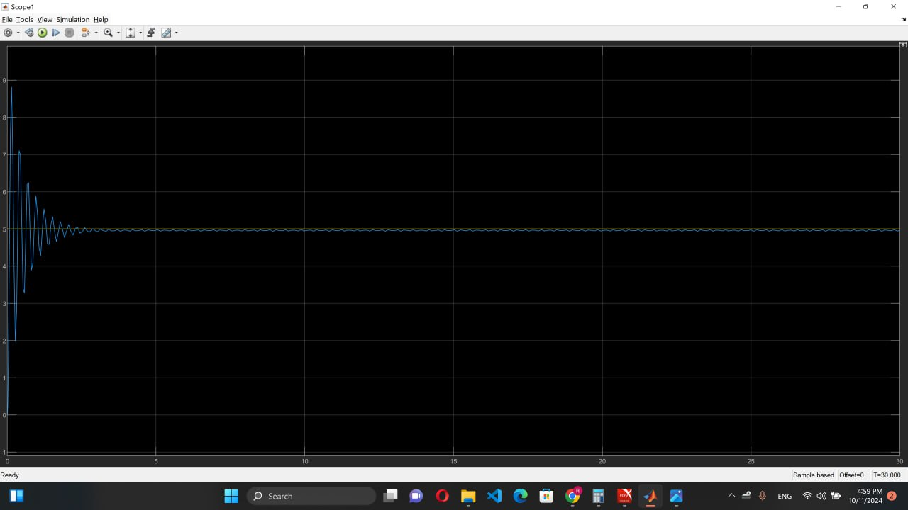
    - Increased \( K_d \) further to dampen oscillations more effectively.

15. **Effect of Higher \( K_d \) on Stability** 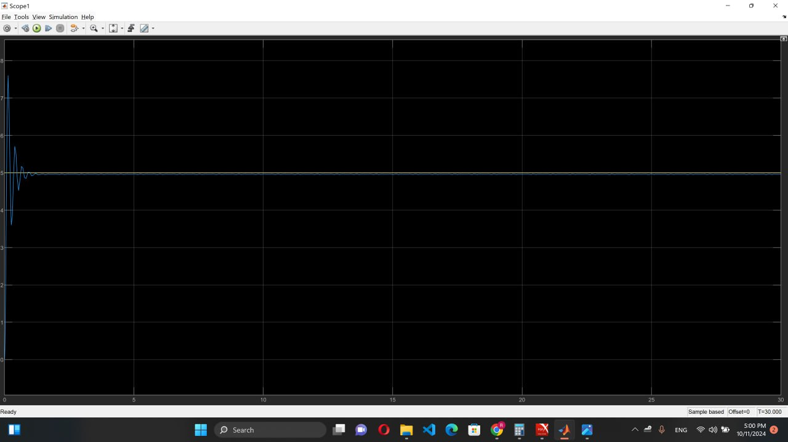
    - The system showed even less oscillatory behavior, indicating improved stability.

16. **Testing Negative Proportional Gain** \( K_p = -1000 \), \( K_d = 0 \) 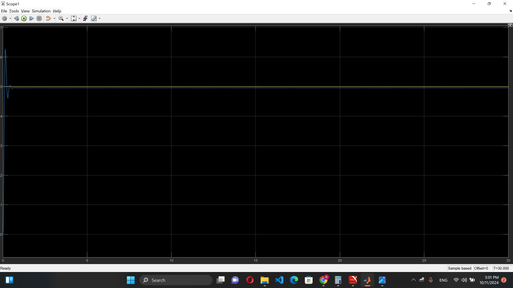
    - Experimented with a negative \( K_p \), which destabilized the system significantly, as expected.

17. **Reverting to Positive \( K_p \) and High \( K_d \)** \( K_p = 1000 \), \( K_d = 10 \) 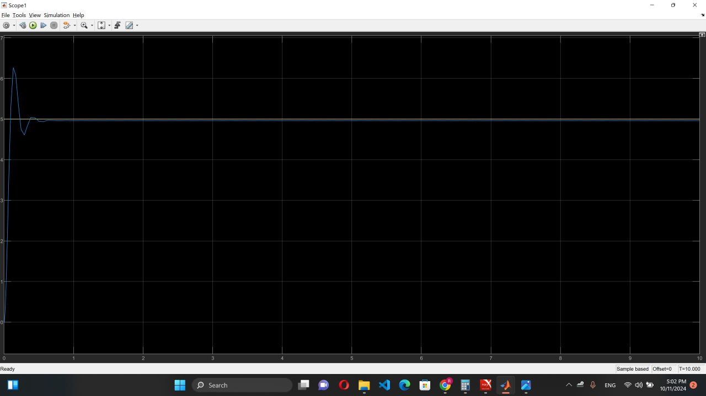
    - Reverted \( K_p \) to a positive value and increased \( K_d \) to 10 for better control.

18. **Optimized Response with High PD Gains** \( K_p = 1000 \), \( K_d = 10 \) 
    - Achieved optimal response with minimal oscillations and fast settling time.

19. **Final Result** 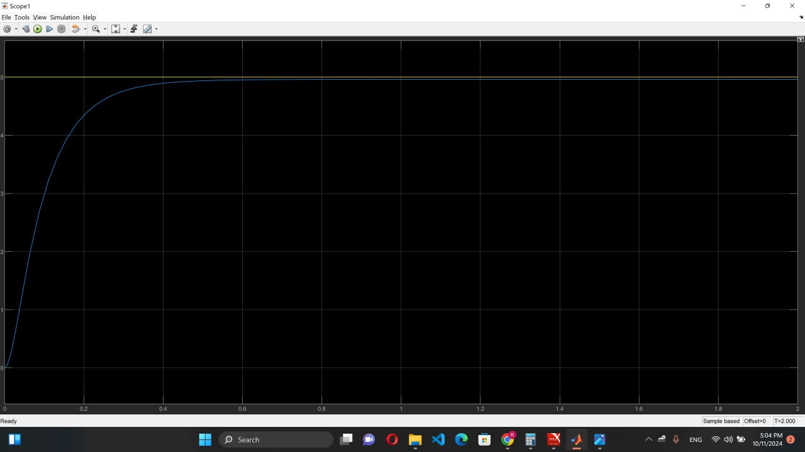
    - The final configuration provided a smooth and stable response, demonstrating the effectiveness of PD control in achieving desired stability and response rate.

## Observations
Throughout the process, adjusting \( K_p \) and \( K_d \) values revealed the following insights:
- Increasing \( K_p \) alone increases the response rate but may cause instability.
- Adding \( K_d \) helps dampen oscillations and stabilize the system.
- Negative values for \( K_p \) destabilize the system entirely.

## Conclusion
This exercise provided a comprehensive understanding of system dynamics and control through the mass-spring-damper model. By applying PD control and adjusting the gains, we achieved a stable response, demonstrating the significance of both proportional and derivative control in embedded system design.
